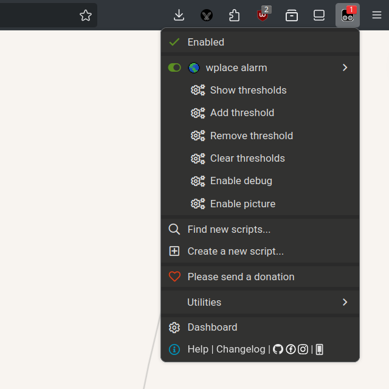
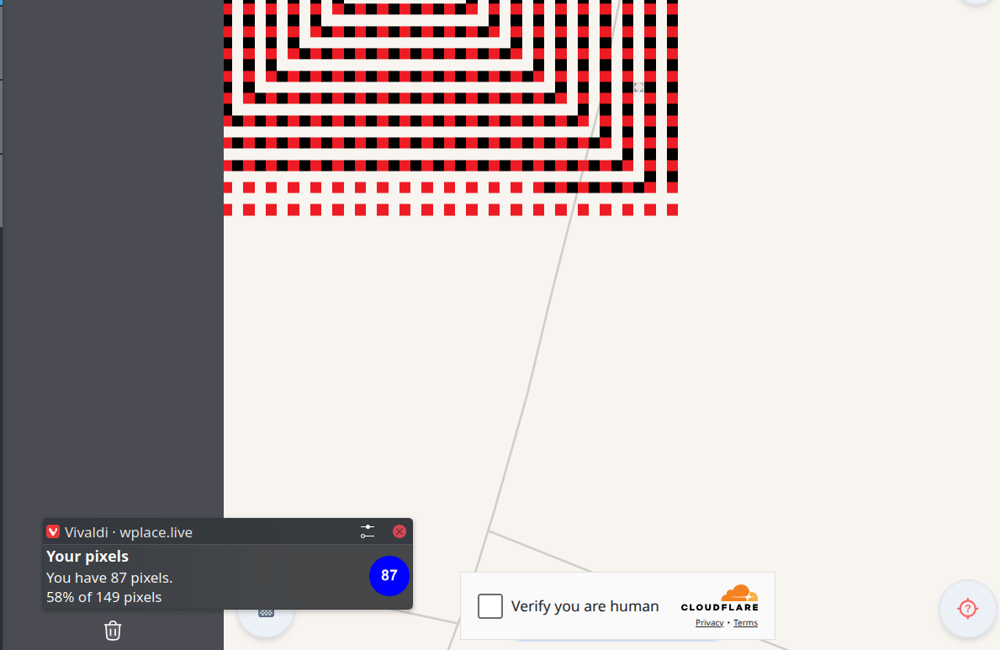
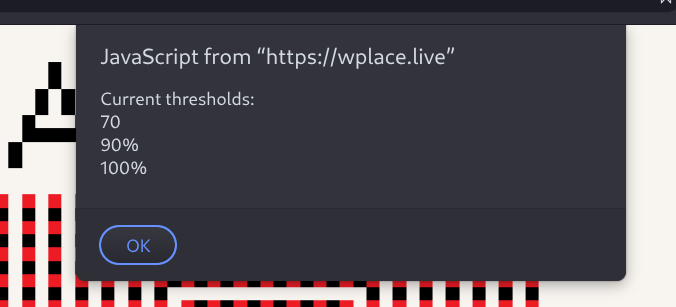
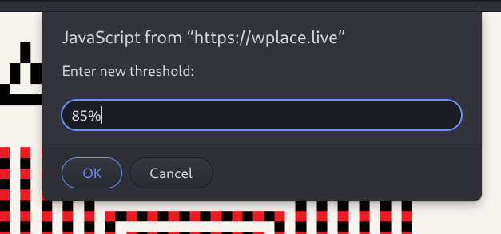

# My user scripts

## Usage

1. Install [Tampermonkey](https://www.tampermonkey.net/) or a similar userscript manager.
2. Install the script from the following link.

## Wplace Alarms

Link: [Install](https://github.com/oPOCCOMAXAo/wplace-userscripts/raw/refs/heads/master/alarm.user.js)

This userscript provides alarm and notification features for the wplace.live website, helping users track their pixel counts and receive alerts when certain thresholds are reached.

**Menu (from the extension)**:

**Notification example**:

**Multiple configurable thresholds (menu: Show thresholds)**:

**Users can set threshold for absolute value or percentage (menu: Add threshold)**:

### Key Features

#### Threshold-based Notifications:

Users can set pixel count thresholds (absolute or percentage). When their pixel count crosses a threshold, a notification is triggered.

#### Customizable Thresholds:

Users can add, remove, and clear thresholds via menu commands.

#### Pixel Count Notifications:

Notifications display the current pixel count, percentage of max, and optionally a badge image.

#### Menu Commands:

The script registers several menu commands for user interaction:

- Show thresholds - print all current thresholds
- Add threshold - add a new threshold from prompt
- Remove threshold - remove a threshold from prompt
- Clear thresholds - clear all thresholds
- Request notifications - request notification permissions (if not already granted)
- Enable/Disable debug - toggle debug mode - extra information displayed in notifications
- Enable/Disable picture - toggle picture mode - show/hide picture in notifications

#### Persistent Configuration:

Uses Greasemonkey/Tampermonkey APIs to store user settings and thresholds.

#### Automatic Updates:

Periodically checks the user's pixel count and updates notifications accordingly.

#### Usage

1. The script runs automatically on wplace.live.
2. Users interact via the userscript menu to manage thresholds and settings.
3. Notifications are shown when pixel counts cross user-defined thresholds.
